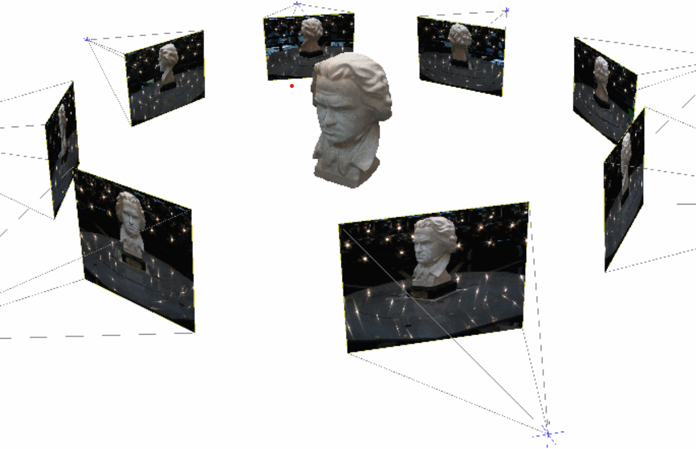
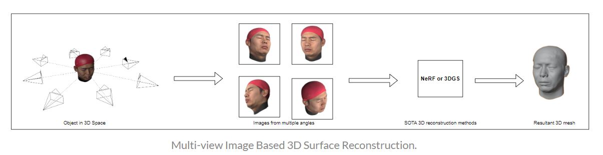
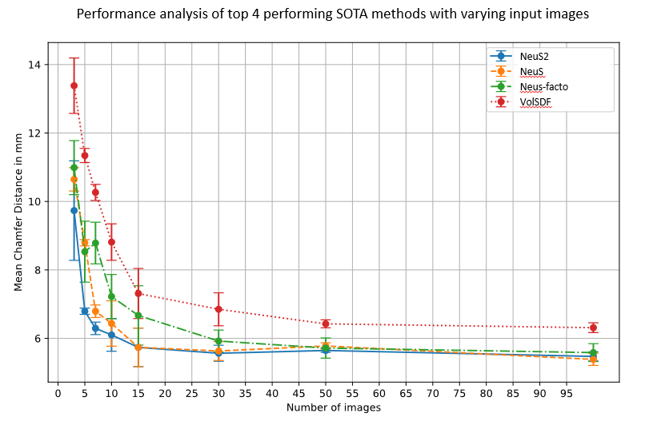
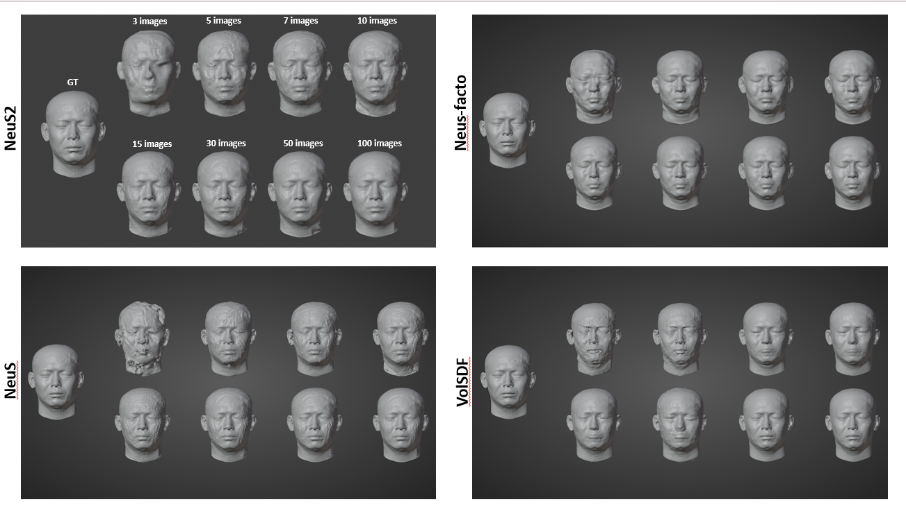
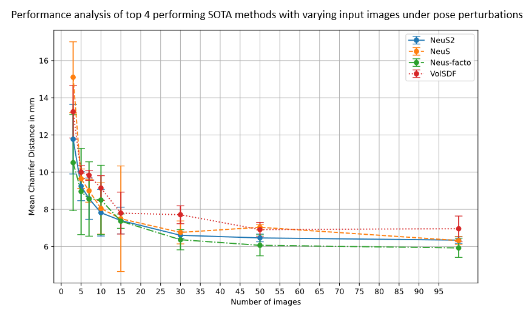
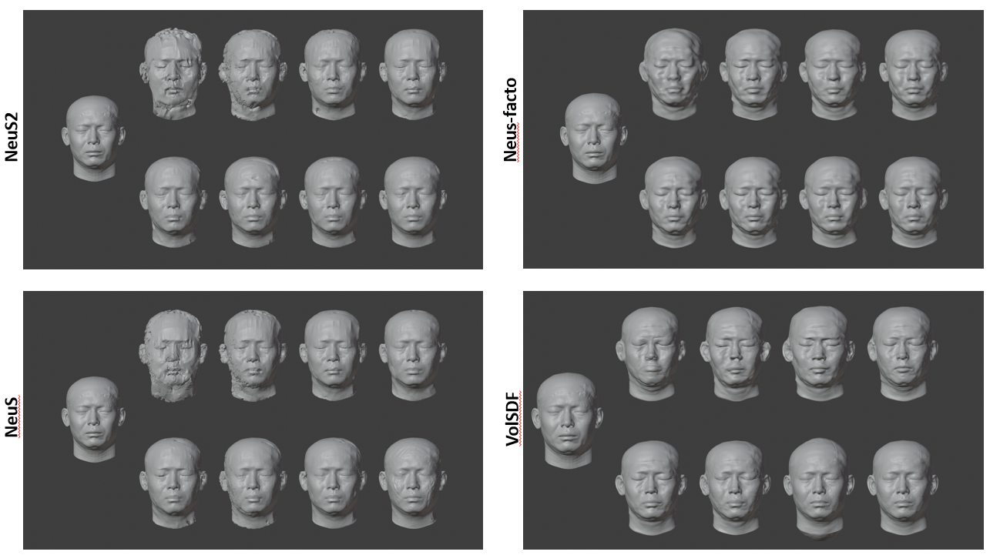
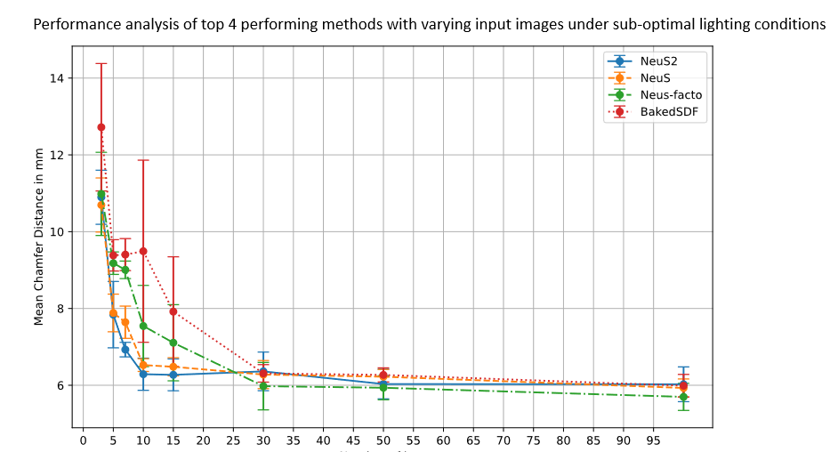
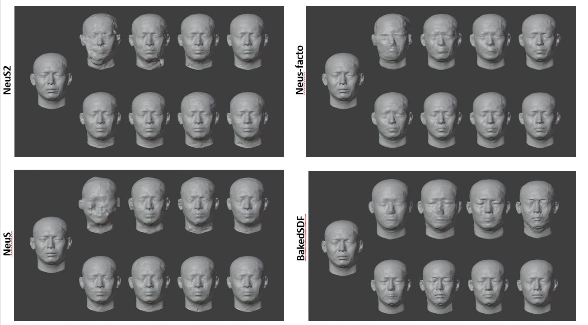

# Analyzing the Impact of Input Parameters in Neural Rendering and Gaussian Splatting Methods for 3D Modeling of the Human Head

## Abstract

Reconstructing high-quality 3D models from multi-view images remains an ill-posed problem in the field of computer vision. Over recent years, Neural Radiance Field (NeRF) has emerged as a leading approach for addressing various computer vision tasks, including image-based 3D reconstruction. NeRF has demonstrated superior results in both novel view synthesis and 3D reconstruction of scenes and objects. Image-based neural rendering methods for surface reconstruction provide considerable advantages over traditional surface reconstruction methods, producing highly detailed 3D models. However, these methods typically rely on high-quality and dense input images for effective 3D reconstruction. In particular, sparse views in input images significantly constrain the high-fidelity reconstruction capabilities of neural rendering methods. Obtaining such high-quality and dense data is not always feasible in real-world settings, thereby limiting their practical applicability. 

This study systematically examines the influence of input parameters on the quality of 3D reconstruction models. By analyzing these methods, we aim to identify robust 3D surface reconstruction methods from images that provide good results even with imperfect input conditions. We believe our findings will inspire further research into NeRF-based and Gaussian Splatting methods, helping improve the robustness of 3D reconstruction techniques for diverse real-world applications.

## Objectives

The motivation behind this study is to explore the robustness of advanced surface reconstruction techniques under real-world conditions, such as sparse image availability and suboptimal input quality.

The key contributions of this research include:
- **Performance Evaluation with Sparse and Dense Images:** The study systematically evaluates state-of-the-art (SOTA) 3D reconstruction methods using varying numbers of input images, ranging from sparse (as few as three images) to dense (up to 100 images). It was found that reconstruction accuracy generally decreases with a reduced number of images, and there is no significant improvement in quality when more than 15 images are used.
- **Robustness to Inaccurate Camera Poses:** The research examines how inaccuracies in camera poses affect 3D reconstruction. The findings indicate that imperfect camera poses lead to less precise reconstructions that lack fine details.
- **Performance Under Sub-optimal Lighting Conditions:** The impact of poor lighting conditions on reconstruction quality is analyzed. The results show a notable decline in performance under low-light conditions, as it becomes difficult to capture accurate surface details and textures.
- **Determination of Robust Methods:** The study assesses various SOTA methods to identify those most effective for 3D reconstruction in both optimal and suboptimal conditions. This comparative analysis provides insights into the robustness of different techniques.

## Methodology

The methodology section outlines the experimental setup, including the selection of SOTA methods, datasets, and evaluation metrics. 

### 1. Selection of 3D Reconstruction Methods

The study evaluates several advanced 3D reconstruction techniques, primarily focusing on neural rendering methods that have shown promising results in recent research. The methods examined include:
- **Neural Radiance Fields (NeRF):** A popular method for 3D scene reconstruction that learns a volumetric scene function from a collection of 2D images, rendering the scene from novel viewpoints.
- **NeuS:** An extension of NeRF that focuses on reconstructing surfaces instead of volumetric data by learning an implicit surface representation.
- **VolSDF:** A method that combines volume rendering with surface representation, providing a balance between flexibility and accuracy.
- **Gaussian Splatting:** A recent approach that uses Gaussian basis functions to represent scenes, offering advantages in handling sparse and noisy data.

These methods were selected due to their state-of-the-art performance in 3D reconstruction tasks and their potential robustness to varying input conditions.

### 2. Experimental Setup

The experimental setup is designed to systematically assess the impact of different input parameters on reconstruction quality:
- **Input Image Quantity:** The experiments vary the number of input images used for reconstruction, ranging from sparse (as few as three images) to dense (up to 100 images). This variation allows the study to evaluate how the quantity of input images affects reconstruction accuracy and fidelity.
- **Camera Pose Accuracy:** The accuracy of camera poses is another critical factor influencing reconstruction quality. The experiments introduce pose perturbations to simulate inaccuracies in camera positioning, testing the methods' robustness to these variations.
- **Lighting Conditions:** The experiments also consider suboptimal lighting conditions, such as low-light scenarios, to understand how different methods perform when the quality of input images is compromised by poor lighting.

### 3. Evaluation Metrics

The reconstruction quality is evaluated using several metrics, including:
- **Reconstruction Accuracy:** Measured by comparing the reconstructed 3D models to ground truth data. Metrics such as Chamfer distance, mean squared error (MSE), and peak signal-to-noise ratio (PSNR) are commonly used for this purpose.
- **Surface Fidelity:** Assesses the accuracy of the surface details in the reconstructed models, focusing on how well fine-grained features are preserved.
- **Robustness to Perturbations:** Evaluates how the methods handle variations in input conditions, such as reduced image quality or pose inaccuracies.

The experiments are conducted on high-performance computing clusters equipped with GPUs to handle the computational demands of training and evaluating neural networks.

## Dataset

The dataset used in this study is crucial for training and evaluating the reconstruction methods. Here are the key details about the dataset:

### FaceScape Dataset

The FaceScape dataset is employed for rendering synthetic face images used in the experiments. This dataset is chosen for its high-quality 3D face scans and diverse range of facial expressions and poses. Key characteristics of the FaceScape dataset include:
- **High-Resolution 3D Scans:** The dataset includes high-resolution 3D scans of human faces, providing detailed surface geometry and texture information essential for training and evaluating 3D reconstruction methods.
- **Diverse Facial Expressions and Poses:** FaceScape captures a wide range of facial expressions and poses, offering a comprehensive set of training data that helps in generalizing the reconstruction methods to various real-world scenarios.
- **Synthetic Image Rendering:** The dataset allows the generation of synthetic images from different viewpoints, simulating the multi-view image inputs required for neural surface reconstruction. This synthetic approach ensures control over input parameters such as lighting, pose, and image quality, facilitating systematic experimentation.

### Data Preparation and Augmentation

To further enhance the robustness of the evaluation, the study employs data augmentation techniques to simulate various real-world conditions:
- **Pose Perturbations:** Synthetic perturbations are applied to camera poses to simulate inaccuracies, testing how well the reconstruction methods can handle pose errors.
- **Lighting Variations:** Different lighting conditions are simulated, including low-light scenarios, to evaluate the impact on reconstruction quality.
- **Sparse and Dense Image Sets:** The dataset is manipulated to create both sparse and dense image sets, allowing the study to systematically assess the effect of image quantity on reconstruction performance.

## Results

The results are divided into several experiments:

### Experiment 1: Impact of Image Quantity on Reconstruction Quality
The findings reveal that using a sparse set of images significantly reduces reconstruction accuracy.

Following are the Quantitative and Qualitative results of the top 4 performing SOTA methods:

### Experiment 2: Effect of Pose Perturbations on Reconstruction Quality
The results indicate that inaccuracies in camera poses negatively impact the quality of the reconstructed 3D models.

Following are the Quantitative and Qualitative results of the top 4 performing SOTA methods:

### Experiment 3: Impact of Suboptimal Lighting Conditions on Reconstruction Quality
The results demonstrate a decline in reconstruction quality under poor lighting conditions.

Following are the Quantitative and Qualitative results of the top 4 performing SOTA methods:

## Limitations and Future Work

The study acknowledges certain limitations, such as the reliance on synthetic datasets and the computational expense of neural methods. Future research could focus on improving the efficiency of these methods and exploring alternative datasets to enhance the robustness and applicability of 3D reconstruction techniques in diverse real-world scenarios.

## Conclusion

The study concludes that while advanced neural surface reconstruction methods like NeRF and Gaussian Splatting show promise in producing high-quality 3D models, their performance is significantly affected by input quality, quantity, and accuracy. The research provides valuable insights into the strengths and limitations of current SOTA methods and encourages further exploration to enhance their robustness in practical applications.
